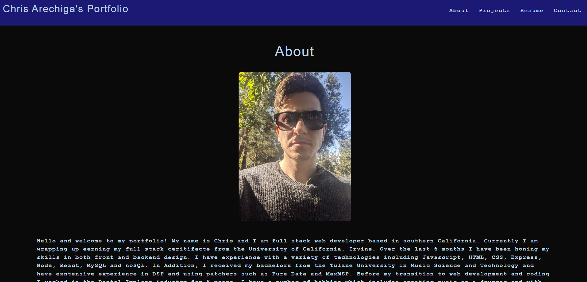

# My React Portfolio  	

## Description

As a web developer it is important for me to have a public portfolio to showcase my skills and works
In addition to showcasing other projects I have worked on for potential employers, this portfolio was built to help my get a grasp on using React to create components to have a single page application that doesn't need to refresh to render new content

## Table of Contents

- [My React Portfolio  	](#my-react-portfolio--)
  - [Description](#description)
  - [Table of Contents](#table-of-contents)
  - [Installation](#installation)
  - [Usage](#usage)
  - [Credits](#credits)
  - [License](#license)
  - [Tests](#tests)
  - [Questions](#questions)

## Installation
Nothing to install here

## Usage

This is my portfolio, simply navigate to the url and look around. If anything interests you or you have any questions go ahead and contact me on the contact page

## Credits

Contact form functionality comes from webjs 

## License

This application is covered under the following license: MIT License

## Tests

There are no tests for this application

## Questions
If you have questions about this application you can reach me for more information here - 

Github: github.com/carechiga

Email: carechiga43@gmail.com